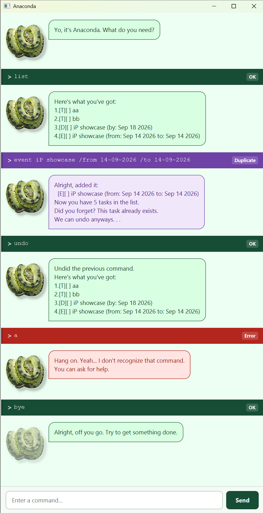

# Anaconda User Guide

Anaconda keeps track of your todos, deadlines, and events through typed commands.
Helpful, organized, and slightly annoyed about it.

## Quick start

1. Install **Java 25**.
2. Put `Anaconda.jar` in a folder of your choice. Open a terminal there and run `java -jar Anaconda.jar`.
3. Type a command and press **Enter** or click **Send**. Try `help` first.

Running from source? Use `.\gradlew.bat run` in the project root (`./gradlew run` on macOS/Linux).
You can resize the window and scroll through earlier replies.

## Commands

Replace uppercase placeholders with your own text. `[sharp]` is optional; do not type the brackets.
Command names ignore case, but date markers inside task commands must be lowercase.
`help`, `list`, `clear`, and `bye` take no extra arguments.

| Action | Format | Example |
| --- | --- | --- |
| Show commands | `help` | `help` |
| Add a todo | `todo DESCRIPTION` | `todo read book` |
| Add a deadline | `deadline DESCRIPTION /by DATE` | `deadline report /by 2026-09-20` |
| Add an event | `event DESCRIPTION /from START_DATE /to END_DATE` | `event workshop /from 2026-09-20 /to 2026-09-21` |
| Show all tasks | `list` | `list` |
| Mark complete | `mark TASK_NUMBER` | `mark 1` |
| Mark incomplete | `unmark TASK_NUMBER` | `unmark 1` |
| Delete one task | `delete TASK_NUMBER` | `delete 1` |
| Search descriptions | `find KEYWORD` | `find report` |
| Tasks ending on/before a date | `/by DATE [sharp]` | `/by 2026-09-20` |
| Tasks ending on/after a date | `/from DATE [sharp]` | `/from 2026-09-20 sharp` |
| Undo a task change | `undo` | `undo` |
| Reverse an undo (redo) | `undo undo` | `undo undo` |
| Remove all tasks | `clear` | `clear` |
| Say goodbye | `bye` | `bye` |

### Adding tasks and dates

Descriptions are required and may contain spaces. Todos have no date; deadlines have a due date;
events have a start and end date.

Use `yyyy-MM-dd` or `dd-MM-yyyy`: `2026-09-20` and `20-09-2026` are equivalent.
Times of day and impossible dates such as February 30 are rejected. An event cannot end before it starts;
same-day events are allowed.

Duplicates are **added**, with a purple warning. Type `undo` if that was accidental.
A duplicate has the same type, description (ignoring case), and dates, regardless of completion status.

### Reading and updating tasks

For example, `1.[D][X] report (by: Sep 20 2026)` is task 1, a completed deadline.
`[T]` means todo, `[D]` deadline, and `[E]` event. `[X]` means complete; `[ ]` means incomplete.

**Use numbers from the full `list` output** for `mark`, `unmark`, and `delete`.
Numbers start at 1 and change after deletion. Search results are numbered separately, so run `list`
before changing a task you found through a search or date filter.

### Searching and filtering

`find` matches text anywhere in descriptions, ignoring case. `find read book` searches for that complete
phrase. No matches? Anaconda says `Nothing. No matching tasks.`

Date filters use a deadline's due date or an **event's end date**, and exclude todos.
`/by` includes dates on or before the given date; `/from` includes dates on or after it.
Add `sharp` to match only that exact date. `by` and `from` also work without the slash.

### Undo, redo, and clear

`undo` reverses the latest saved addition, mark, unmark, deletion, or clear and shows the resulting list.
Repeat it to undo earlier changes. `undo undo` reverses the latest undo.

Redo works only during consecutive `undo` / `undo undo` commands. Any other input, including `list`,
`help`, or invalid input, ends the redo sequence. Ordinary undo history remains available.
Both histories reset when you restart. See [Undo details](undo.md) for examples.

**`clear` removes everything immediately, without confirmation.** Use `undo` to restore the list.

## Feedback and help

| Color / badge | Meaning |
| --- | --- |
| Dark green / **OK** | Command succeeded. |
| Yellow / **Check input** | Recognized command with invalid input or an invalid operation. |
| Purple / **Duplicate** | Matching task found; the new task was still added. |
| Red / **Error** | Unknown input or a saving failure. |

Yellow errors for commands with arguments include the correct format and an example.
Unknown or blank input suggests `help`; type it to see all commands.

## Saving and leaving

Changes save automatically to `data/anaconda.txt` under the folder you launch Anaconda from.
Start from the same folder each time. If saving fails, the change is rolled back.

If the file is corrupted or unreadable, Anaconda warns you and starts with an empty list.
The old file remains until the next successful list change replaces it. **Copy it before making changes
if you want to recover its contents.** A missing file is normal on the first run.

`bye` displays a farewell in the GUI; **close the window to exit**. In the console, `bye` ends the session.
